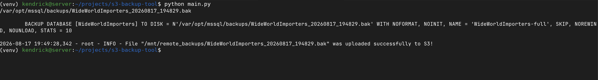

<div align="center">

# S3 Backup Tool

One script, one command - back up your SQL Server Database and push it to S3 automatically.




</div>

---

### Table of Contents
- [Introduction](#introduction)
- [Features](#features)
- [Prerequisites](#prerequisites)
- [Install](#install)
- [Setting up AWS S3](#setting-up-aws-s3)

---

# Introduction

S3 Backup Tool is a Python utility for SQL Server Databases that creates a database backup file and pushes it to a S3 bucket by running a single command.  

It does exactly two things:

1. **Dump** - connects to SQL Server over ODBC (`pyodbc`) and writes a timestamped `{database}_{YYYYMMDD_HHMMSS}.bak` to disk.

2. **Push** - uploads that backup to your S3 bucket with `boto3`, using a named AWS profile.

---

# Features

- Automation-friendly program that does not require an interactive prompt to generate a backup.
- Native SQL Server backups.
- Timestamped backup files to never overwrite backups with the same date.
- Automatic upload to a Amazon S3 bucket via boto3.
- Environment-based configuration which keeps secrets out of the code and out of version control.
- Docker-aware backup paths — handles container/remote setups where SQL Server writes to one path (`BACKUP_DIR`) and the host reads the file from another (`HOST_BACKUP_DIR`), falling back to a single path when they match.
- Support for AWS named profiles. Authenticate to S3 using a existing named AWS profile in AWS cli.
- Multiple logging verbosity levels.
- Support for many ODBC drivers

---

# Prerequisites

- Python 3.13
- aws cli
- ODBC Driver 18
- An AWS CLI profile
- An AWS S3 Bucket
- An SQL database user with `db_backup_operator` role

---

# Install

1. Clone the repository

```bash
git clone https://github.com/IgnachoGutierrez/s3-backup-tool.git
cd s3-backup-tool
```

2. Set up a virtual environment

This project is pinned to the Python version in `.python-version`. We recommend using
[pyenv](https://github.com/pyenv/pyenv) so your environment matches that version:

```bash
pyenv install 3.13.1   # install the pinned version (skip if already installed)
pyenv local 3.13.1     # honor .python-version in this repo
```

With pyenv active, `python` now resolves to 3.13.1. Create and activate the virtual environment:

```bash
python -m venv .venv
source .venv/bin/activate      # on Windows: .venv\Scripts\activate
```

3. Install dependencies

```bash
pip install -r requirements.txt
```

4. Set up environment variables

Copy the example file and fill in your values:

```bash
cp .env.example .env
```

Edit `.env` with the following variables:

| Variable                | Required | Description                                                             |
| ----------------------- | -------- | ----------------------------------------------------------------------- |
| `AWS_PROFILE_NAME`      | Yes      | Name of the AWS CLI profile used to upload to S3.                       |
| `S3_BUCKET`             | Yes      | Target S3 bucket name.                                                  |
| `SERVER`                | Yes      | SQL Server host/instance to connect to.                                 |
| `DB`                    | Yes      | Name of the database to back up.                                        |
| `DB_USER`               | Yes      | SQL Server login username.                                              |
| `DB_PASSWORD`           | Yes      | SQL Server login password.                                              |
| `DRIVER`                | Yes      | ODBC driver name, e.g. `ODBC Driver 18 for SQL Server`.                 |
| `BACKUP_DIR`            | Yes      | Directory **on the SQL Server host** where the `.bak` is written.       |
| `HOST_BACKUP_DIR`       | No       | Path to the `.bak` as seen by this tool. Defaults to `BACKUP_DIR`.      |
| `DB_TRUST_SERVER_CERT`  | No       | `yes` or `no` (default `no`). Set `yes` for self-signed server certs.   |

> `.env` is git-ignored, so your credentials stay out of version control.

5. Run the tool

```bash
python main.py                 # default logging level: info
python main.py --logging debug # more verbose output
```

---

# Setting up AWS S3

The tool uploads each database backup to an S3 bucket. You'll need an AWS account, a
bucket to receive the `.bak` files, and an AWS CLI profile with permission to write to it.

### 1. Create the bucket

**Using the AWS Console**

1. Sign in to the [S3 console](https://console.aws.amazon.com/s3/).
2. Choose **Create bucket**.
3. Enter a globally unique **Bucket name** (e.g. `my-company-sql-backups`) and pick the
   **AWS Region** closest to your database server.
4. Leave **Block all public access** enabled — backups should never be public.
5. (Recommended) Enable **Bucket Versioning** and **Default encryption (SSE-S3 or SSE-KMS)**.
6. Choose **Create bucket**.

### 2. Create an AWS profile the tool can use

The tool authenticates with a **named AWS CLI profile** (via `AWS_PROFILE_NAME`), not
inline keys. Configure one with credentials for an IAM user or role:

```bash
aws configure --profile s3-backup
```

You'll be prompted for the Access Key ID, Secret Access Key, default region, and output format.

### 3. Grant permission to upload

The profile's IAM identity needs at least `s3:PutObject` on the bucket. Attach a policy like:

```json
{
  "Version": "2012-10-17",
  "Statement": [
    {
      "Effect": "Allow",
      "Action": "s3:PutObject",
      "Resource": "arn:aws:s3:::my-company-sql-backups/*"
    }
  ]
}
```

### 4. Wire it into the tool

Set the matching values in your `.env`:

```dotenv
S3_BUCKET=my-company-sql-backups
AWS_PROFILE_NAME=s3-backup
```

Verify the profile can reach the bucket before running the tool:

```bash
aws s3 ls s3://my-company-sql-backups --profile s3-backup
```
